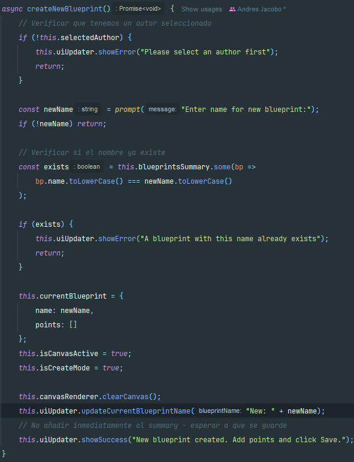

#### Escuela Colombiana de Ingeniería
#### Procesos de desarrollo de software - PDSW
#### Construción de un cliente 'grueso' con un API REST, HTML5, Javascript y CSS3. Parte II.


1. Agregue al canvas de la página un manejador de eventos que permita capturar los 'clicks' realizados, bien sea a través del mouse, o a través de una pantalla táctil. Para esto, tenga en cuenta [este ejemplo de uso de los eventos de tipo 'PointerEvent'](https://mobiforge.com/design-development/html5-pointer-events-api-combining-touch-mouse-and-pen) (aún no soportado por todos los navegadores) para este fin. Recuerde que a diferencia del ejemplo anterior (donde el código JS está incrustado en la vista), se espera tener la inicialización de los manejadores de eventos correctamente modularizado, tal [como se muestra en este codepen](https://codepen.io/hcadavid/pen/BwWbrw).

   	Se añadió un manejador ``pointerdown`` (con fallback a ``click``) al ``<canvas>`` y su inicialización está modularizada en ``app.js`` (register en ``init()``), siguiendo el patrón del ejemplo PointerEvent / el codepen.

	

    
    
3. Agregue lo que haga falta en sus módulos para que cuando se capturen nuevos puntos en el canvas abierto (si no se ha seleccionado un canvas NO se debe hacer nada):
	1. Se agregue el punto al final de la secuencia de puntos del canvas actual (sólo en la memoria de la aplicación, AÚN NO EN EL API!).

 		Cuando hay un blueprint activo, cada pointer/click calcula la coordenada en el canvas, la transforma a coordenadas de datos e **inserta el punto al final** de la secuencia ``_currentBlueprint.points`` (solo en memoria); si no hay canvas seleccionado no ocurre nada.

		

		
    		
	2. Se repinte el dibujo.

    	Después de añadir el punto la aplicación **re-dibuja inmediatamente** el plano con la misma rutina de renderizado y actualiza el contador de puntos en la tabla y el total mostrado.

    	

		**Evidencias:**

	    

	    
   
4. Agregue el botón Save/Update. Respetando la arquitectura de módulos actual del cliente, haga que al oprimirse el botón:

   Se implementó un botón **Save/Update** que al presionarse reúne la geometría actual del canvas, construye el objeto ``blueprint`` y envía un ``PUT`` al recurso REST correspondiente (``/blueprints/{author}/{name}``) usando ``$.ajax`` con ``JSON.stringify``. Al resolverse el ``PUT`` encadenamos (promesas) un ``GET /blueprints`` para refrescar la lista completa de planos en la UI y, finalmente, recalculamos el puntaje total del usuario sumando la cantidad de puntos de todos sus planos y actualizamos la vista. Se manejan errores con ``catch`` y se muestran mensajes al usuario.

   	

	1. Se haga PUT al API, con el plano actualizado, en su recurso REST correspondiente.

   		

   		
	
   2. Se haga GET al recurso /blueprints, para obtener de nuevo todos los planos realizados.

	   

   	   

   3. Se calculen nuevamente los puntos totales del usuario.

   		

		

    Para lo anterior tenga en cuenta:

    * jQuery no tiene funciones para peticiones PUT o DELETE, por lo que es necesario 'configurarlas' manualmente a través de su API para AJAX. Por ejemplo, para hacer una peticion PUT a un recurso /myrecurso:

    ```javascript
    return $.ajax({
        url: "/mirecurso",
        type: 'PUT',
        data: '{"prop1":1000,"prop2":"papas"}',
        contentType: "application/json"
    });
    
    ```
    Para éste note que la propiedad 'data' del objeto enviado a $.ajax debe ser un objeto jSON (en formato de texto). Si el dato que quiere enviar es un objeto JavaScript, puede convertirlo a jSON con: 
	
    ```javascript
    JSON.stringify(objetojavascript),
    ```
    * Como en este caso se tienen tres operaciones basadas en _callbacks_, y que las mismas requieren realizarse en un orden específico, tenga en cuenta cómo usar las promesas de JavaScript [mediante alguno de los ejemplos disponibles](http://codepen.io/hcadavid/pen/jrwdgK).

		

5. Agregue el botón 'Create new blueprint', de manera que cuando se oprima:

   Se añadió un botón **Create new blueprint** que limpia el canvas y pide al usuario el nombre del nuevo plano (modal/``prompt``). Al guardar por primera vez se hace un ``POST /blueprints`` con el nuevo ``blueprint`` (JSON), y tras el ``POST`` encadenado se realiza un ``GET /blueprints`` para actualizar la lista y recalcular el puntaje del usuario. La opción de “guardar” cambió su flujo: si el plano es nuevo usa ``POST`` (crear), si existe usa ``PUT`` (actualizar).

   
	
	* Se borre el canvas actual.

		

	* Se solicite el nombre del nuevo 'blueprint' (usted decide la manera de hacerlo).

   		

	Esta opción debe cambiar la manera como funciona la opción 'save/update', pues en este caso, al oprimirse la primera vez debe (igualmente, usando promesas):

	1. Hacer POST al recurso /blueprints, para crear el nuevo plano.

   		

    2. Hacer GET a este mismo recurso, para actualizar el listado de planos y el puntaje del usuario.

   		

6. Agregue el botón 'DELETE', de manera que (también con promesas):

   Se agregó el botón **DELETE** que, tras confirmar la acción, borra el canvas, realiza un ``DELETE`` al recurso correspondiente (``/blueprints/{author}/{name}``) y luego encadena un ``GET /blueprints`` para obtener la lista actualizada y recalcular los puntos. Todo el flujo usa promesas para garantizar el orden correcto y maneja errores/confirmaciones para que el usuario no pierda datos sin querer.

   

   

	* Borre el canvas.

		       

	* Haga DELETE del recurso correspondiente.

			  

	* Haga GET de los planos ahora disponibles.

	  

### Demo Pagina

https://youtu.be/sM8Lw8Fq-gM
	
